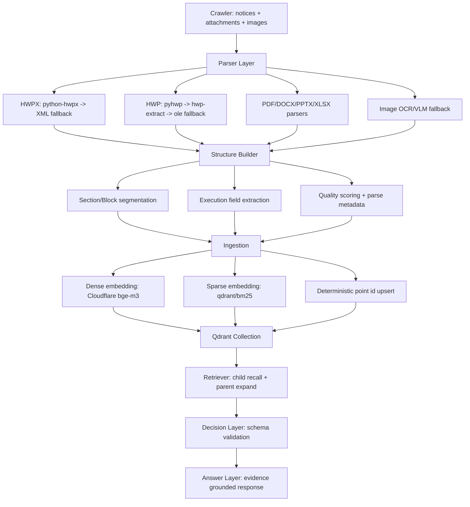

# KNU Notice Pipeline: Structure-First Architecture (2026-03-01)

> This document is an implementation spec.  
> Code must follow this file as source of truth.

## 1) Goal

기존 `chunk 중심 검색`에서 `구조 중심 실행`으로 전환한다.

- 목적: "찾아주는 AI" -> "실행 가능한 AI"
- 원칙: Retrieval 정확도보다 `Structure 신뢰도`와 `Reproducibility`를 우선
- 제약: Graph DB는 당장 도입하지 않고 Qdrant + 구조화 payload로 구현

---

## 2) High-Level Architecture



---

## 3) Data Model (Core)

문서 저장 단위를 `Document -> Section -> Block`으로 고정한다.

### 3.1 Document (raw + metadata)

- `doc_id`: deterministic hash(url + date + dept + title)
- `source`: notice page url
- organization scope:
  - `school_id`, `school_name`
  - `campus_id`, `campus_name`
  - `college_id`, `college_name`
  - `dept_id`, `dept_name`
  - `program_level` (`undergrad | graduate | all`)
  - `audience_tags[]` (e.g. `freshman`, `international`, `exchange`, `enrolled`)
- `date`, `title`
- `attachments[]`
- `pipeline_version`, `schema_version`

### 3.2 Section (logical group)

- `section_id`
- `doc_id`
- `section_header`
- `section_index`
- `section_type`: `body | attachment | image_analysis | table`

### 3.3 Block (retrieval and execution unit)

- `block_id` (deterministic)
- `doc_id`, `section_id`
- `block_index`
- routing keys:
  - `school_id`
  - `campus_id`
  - `college_id`
  - `dept_id`
  - `program_level`
- `block_type`:
  - `deadline`
  - `eligibility`
  - `required_docs`
  - `procedure`
  - `contact`
  - `fee`
  - `policy`
  - `attachment_summary`
  - `general`
- `text`
- `bm25_text`
- `parent_text` (for parent expansion)
- `source_span` (offset or anchor)
- parse quality:
  - `parser_name`
  - `parser_version`
  - `parse_confidence`
  - `parse_error`
  - `extraction_method`

---

## 4) Indexing Strategy (Big Tech style adapted)

## 4.1 Parent-Child Dual Index

- `child block`: 검색 recall 용 (짧은 단위)
- `parent block`: 최종 답변 컨텍스트 용 (넓은 단위)
- 검색은 child 중심, 답변 생성은 parent 확장 중심

### Recommended size

- Child: 300~700 tokens equivalent
- Parent: 1,500~3,000 tokens equivalent
- 표/마감/요건 블록은 가능하면 분할 최소화

## 4.2 Vectors

- Dense: Cloudflare Workers AI `@cf/baai/bge-m3` (1024)
- Sparse: Qdrant Cloud Inference `qdrant/bm25`

## 4.3 Deterministic Upsert

- `point_id = sha1(url + section_id + block_type + block_index + date + dept)`
- 재실행 시 동일 id upsert (중복 업로드 제거)

## 4.4 ID/Name Rule (important)

- 검색/필터/권한/라우팅은 항상 `*_id` 사용
- UI 표시/로그는 `*_name` 사용
- 예:
  - `dept_id = "cse"`
  - `dept_name = "컴퓨터학부"`
- 이 규칙을 지키면 다중 학교/다중 캠퍼스 확장 시 재인덱싱 비용이 크게 줄어든다.

---

## 5) Retrieval and Decision Flow

## 5.1 Retrieval

1. query decomposition (multi-intent 분해)
2. hybrid recall (dense + sparse)
3. metadata pre-filter
   - `school_id`, `campus_id`, `dept_id`, `program_level`, `date` range
3. rerank with domain rules
   - deadline/eligibility/required_docs 가중치 우선
4. parent expansion
5. evidence pack 구성

## 5.2 Decision (Execution Object)

답변 전에 반드시 아래 구조 객체 생성:

```json
{
  "action_required": true,
  "target_group": ["학부", "특정학과"],
  "deadline_at": "2026-03-10T23:59:00+09:00",
  "required_documents": ["재학증명서", "신청서"],
  "procedure_steps": ["포털 접속", "서류 업로드", "제출"],
  "contact": "02-000-0000",
  "risk_flags": ["deadline_missing", "eligibility_ambiguous"],
  "evidence_ids": ["..."]
}
```

검증 실패 시:

- `needs_review=true`
- 답변에 불확실성 명시
- 재처리 큐로 적재

---

## 6) LLM Usage Policy (Cost-safe)

- 기본: 파서 + 규칙 기반 구조화
- LLM 호출 조건:
  - 필수 필드 누락
  - parse_confidence 임계치 미달
  - 이미지/스캔 특이 문서
- 모델 순서:
  - primary: Groq
  - fallback: Gemini (선택)
- 실패 시 전체 파이프라인 중단 금지 (문서 단위 폴백)

---

## 7) Quality Gates

문서별 품질 상태:

- `GREEN`: parse_confidence >= 0.85 and mandatory fields complete
- `YELLOW`: 0.6~0.85 or 일부 필드 누락
- `RED`: < 0.6 or parser failure

운영 규칙:

- GREEN만 자동 실행 경로 허용
- YELLOW/RED는 재처리 큐

---

## 8) Changes to Current Codebase

## 8.1 `src/crawl/*`

- 이미 구현된 `.hwp/.hwpx` 다단 파싱 유지
- 첨부별 parse metadata 저장 유지
- 추가: `source_span` 추출 가능하면 저장

## 8.2 `src/etl/ingestion.py`

필수 변경:

1. `KoreanNoticeChunker` -> `StructureBlockBuilder` 로 역할 확장
2. parent-child 동시 생성
3. `block_type` 분류기 추가 (rule-first)
4. payload schema 고정
5. upsert 재시도 정책 추가 (429/5xx)

## 8.3 `src/mcp_server/tools/retriever.py`

필수 변경:

1. child top-k 후 parent 확장 강제
2. `block_type` 기반 rerank
3. evidence 최소 개수 미달 시 보수 응답

---

## 9) Minimal Payload Schema for Qdrant

```json
{
  "doc_id": "uuid",
  "block_id": "uuid",
  "level": "child",
  "parent_id": "uuid",
  "school_id": "knu",
  "school_name": "경북대학교",
  "campus_id": "daegu",
  "campus_name": "대구캠퍼스",
  "college_id": "engineering",
  "college_name": "공과대학",
  "dept_id": "cse",
  "dept_name": "컴퓨터학부",
  "program_level": "undergrad",
  "audience_tags": ["international", "enrolled"],
  "title": "...",
  "date": "2026-03-01",
  "url": "...",
  "section_header": "...",
  "block_type": "deadline",
  "content": "...",
  "bm25_text": "...",
  "parser_name": "...",
  "parser_version": "...",
  "parse_confidence": 0.92,
  "parse_error": "",
  "extraction_method": "text_parser",
  "pipeline_version": "v2.0.0",
  "schema_version": "structure-v1"
}
```

---

## 10) Rollout Plan (PR order)

1. PR-1: 구조 스키마 + block builder + parent/child upsert
2. PR-2: retriever parent 확장 + block_type rerank
3. PR-3: decision object validator + evidence gate
4. PR-4: quality dashboard jsonl (green/yellow/red) + retry queue

---

## 11) Success Criteria

- 같은 입력 문서 재처리 시 동일 block ids 재생성
- mandatory execution fields 정확도 향상
- 답변의 evidence id/URL 누락률 감소
- LLM 호출량 대비 처리 성공률 개선

---

## 12) Implementation Contract (Must)

아래는 "코드 구현 시 반드시 지켜야 하는 계약"이다.

### 12.1 Canonical Field Schema

모든 Qdrant payload는 아래 키를 포함해야 한다.

| field | type | required | default | notes |
|---|---|---|---|---|
| `doc_id` | `str(uuid)` | Y | - | deterministic |
| `block_id` | `str(uuid)` | Y | - | deterministic |
| `level` | `str` | Y | `"child"` | `child` or `parent` |
| `parent_id` | `str(uuid)` | N | `""` | child only |
| `school_id` | `str` | Y | `""` | filter key |
| `school_name` | `str` | N | `""` | display |
| `campus_id` | `str` | Y | `""` | filter key |
| `campus_name` | `str` | N | `""` | display |
| `college_id` | `str` | Y | `""` | filter key |
| `college_name` | `str` | N | `""` | display |
| `dept_id` | `str` | Y | `""` | filter key |
| `dept_name` | `str` | N | `""` | display |
| `program_level` | `str` | Y | `"all"` | `undergrad/graduate/all` |
| `audience_tags` | `list[str]` | N | `[]` | routing |
| `title` | `str` | Y | `""` | - |
| `date` | `str` | Y | `""` | `YYYY-MM-DD` |
| `url` | `str` | Y | `""` | source |
| `section_header` | `str` | N | `""` | - |
| `block_type` | `str` | Y | `"general"` | enum |
| `content` | `str` | Y | `""` | block text |
| `bm25_text` | `str` | Y | `""` | sparse source |
| `parser_name` | `str` | N | `"none"` | quality |
| `parser_version` | `str` | N | `"unknown"` | quality |
| `parse_confidence` | `float` | Y | `0.0` | 0~1 |
| `parse_error` | `str` | N | `""` | - |
| `extraction_method` | `str` | N | `"text_parser"` | - |
| `pipeline_version` | `str` | Y | `"v2.0.0"` | reproducibility |
| `schema_version` | `str` | Y | `"structure-v1"` | reproducibility |

### 12.2 Deterministic ID Formula

- `doc_id = uuid(sha1(url + "|" + date + "|" + dept_id + "|" + title))`
- `parent_id = uuid(sha1(doc_id + "|" + section_header + "|" + parent_index))`
- `block_id = uuid(sha1(parent_id + "|" + block_type + "|" + block_index + "|" + level))`
- UUID 변환은 현재 코드의 `deterministic_point_id()` 방식과 동일하게 구현

### 12.3 Block Type Enum

`block_type` 허용값:

- `deadline`
- `eligibility`
- `required_docs`
- `procedure`
- `contact`
- `fee`
- `policy`
- `attachment_summary`
- `general`

### 12.4 Retrieval Contract

Retriever는 반드시 아래 순서를 지켜야 한다.

1. metadata pre-filter (`school_id`, `campus_id`, `dept_id`, `program_level`, `date`)
2. dense+sparse hybrid child recall
3. `block_type` 가중치 rerank
4. parent expansion
5. evidence pack 반환 (`block_id`, `url`, `section_header`, `score`)

### 12.5 Decision Contract

답변 생성 전 아래 JSON을 먼저 구성해야 한다:

```json
{
  "action_required": false,
  "target_group": [],
  "deadline_at": null,
  "required_documents": [],
  "procedure_steps": [],
  "contact": null,
  "risk_flags": [],
  "evidence_ids": []
}
```

필수 조건:

- `evidence_ids`가 비어 있으면 "보수 응답"으로 전환
- `risk_flags`에 `insufficient_evidence` 추가

### 12.6 File-by-File Required Changes

#### `src/crawl/crawl_notice.py`

- attachment item에 아래 키 저장 강제:
  - `parser_name`
  - `parser_version`
  - `parse_confidence`
  - `parse_error`
  - `extraction_method`

#### `src/etl/ingestion.py`

- `KoreanNoticeChunker` 대체/확장:
  - parent blocks 생성
  - child blocks 생성
  - block_type 분류
- payload에 `school/campus/college/dept/program_level` 매핑
- upsert 재시도 추가 (`429`, `5xx`)

#### `src/mcp_server/tools/retriever.py`

- query 시 metadata filter 인자 지원
- child->parent 확장 필수
- evidence 최소 개수(예: 2) 미달 시 보수 응답 신호

### 12.7 Acceptance Checklist (DoD)

아래 체크가 모두 통과해야 "완료"로 본다.

- [ ] 동일 문서 재실행 시 `block_id` 불변
- [ ] `.hwp/.hwpx/.pdf/.docx/.pptx/.xlsx` 최소 1개씩 파싱 성공
- [ ] 각 첨부에 parse metadata 저장 확인
- [ ] Qdrant point payload에 canonical schema 키 존재
- [ ] retriever 결과에 evidence id/url/section 포함
- [ ] 필드 누락 문서가 재처리 큐로 분리

### 12.8 Non-Negotiables

- 로컬 히스토리 파일(`qdrant_upload.json`) 사용 금지
- secrets 하드코딩 금지
- 외부 API timeout 필수 (`<=30s`)
- 재시도는 `429`/`5xx`에만 적용
- 실패 문서가 있어도 전체 배치 중단 금지
